# Real Machine Data Integration Guide

## 🏭 Connecting Real Machines to Your Monitoring System

You have machines with computers that need to send data to your monitoring system. Here's how to set up the complete data flow:

## 📡 Machine Data Integration Architecture

```mermaid
graph TB
    %% Machine Layer
    subgraph MachineLayer["🏭 Machine Layer"]
        subgraph PhysicalMachines["Physical Machines"]
            AS4000["Automated System 4000<br/>⭕ Production Machine"]
            MS4000["Mini-System 4000<br/>⬜ Research Machine"]
        end
        
        subgraph MachineComputers["Machine Computers"]
            Computer1["Computer 1<br/>💻 Windows 10<br/>HMC-ECM-RELINNI"]
            Computer2["Computer 2<br/>💻 Windows 10<br/>Machine Controller"]
            Computer3["Computer 3<br/>💻 Windows 10<br/>Data Collector"]
        end
        
        subgraph MachineSoftware["Machine Software"]
            SinterCastSW["SinterCast Software<br/>🔧 Machine Control"]
            DataCollector["Data Collector<br/>📊 Sensor Reader"]
            StatusMonitor["Status Monitor<br/>📈 Health Checker"]
        end
    end
    
    %% Data Collection Layer
    subgraph DataCollection["📊 Data Collection Layer"]
        subgraph DataSources["Data Sources"]
            SystemInfo["System Information<br/>🖥️ OS, Uptime, Timezone"]
            SensorData["Sensor Data<br/>🌡️ Temperature, Pressure<br/>⚡ Speed, Disk Usage"]
            MachineStatus["Machine Status<br/>🔄 Operational State<br/>⚠️ Alarms, Errors"]
        end
        
        subgraph DataFormats["Data Formats"]
            JSONFormat["JSON Format<br/>📋 system_info_example.json"]
            APIPayload["API Payload<br/>📡 HTTP POST Data"]
            WebSocketData["WebSocket Data<br/>⚡ Real-time Updates"]
        end
    end
    
    %% Communication Layer
    subgraph Communication["🌐 Communication Layer"]
        subgraph Protocols["Communication Protocols"]
            HTTP["HTTP/HTTPS<br/>🔒 Secure REST API"]
            WebSocket["WebSocket<br/>⚡ Real-time Connection"]
            MQTT["MQTT (Optional)<br/>📡 IoT Protocol"]
        end
        
        subgraph Network["Network Configuration"]
            Firewall["Firewall Rules<br/>🛡️ Port 8000, 443"]
            VPN["VPN Connection<br/>🔐 Secure Tunnel"]
            Internet["Internet Connection<br/>🌍 Global Access"]
        end
    end
    
    %% Backend Processing
    subgraph Backend["🐍 Backend Processing"]
        subgraph APILayer["API Layer"]
            RESTEndpoints["REST Endpoints<br/>🛣️ /api/machines/{id}/status"]
            WebSocketServer["WebSocket Server<br/>⚡ /ws endpoint"]
            AuthLayer["Authentication<br/>🔑 API Keys, Tokens"]
        end
        
        subgraph Processing["Data Processing"]
            DataValidation["Data Validation<br/>✅ Schema Check"]
            StatusDetermination["Status Determination<br/>🎯 Green/Yellow/Red/Black/Grey"]
            AlertGeneration["Alert Generation<br/>🚨 Critical Events"]
        end
        
        subgraph Storage["Data Storage"]
            Database["PostgreSQL<br/>🗄️ Persistent Storage"]
            Cache["Redis Cache<br/>⚡ Fast Access"]
            Files["File Storage<br/>📁 Logs, Backups"]
        end
    end
    
    %% Frontend Display
    subgraph Frontend["⚛️ Frontend Display"]
        subgraph Visualization["Data Visualization"]
            WorldMap["World Map<br/>🗺️ Machine Locations"]
            StatusMarkers["Status Markers<br/>🟢🟡🔴⚫⚪ Color-coded"]
            RealTimeUpdates["Real-time Updates<br/>⚡ Live Status Changes"]
        end
        
        subgraph Analytics["Analytics Dashboard"]
            Metrics["Metrics Display<br/>📊 Temperature, Pressure"]
            Trends["Trend Analysis<br/>📈 Historical Data"]
            Alerts["Alert Management<br/>🚨 Notification System"]
        end
    end
    
    %% Data Flow Connections
    AS4000 -.->|Sensors| Computer1
    MS4000 -.->|Sensors| Computer2
    Computer1 -.->|Runs| SinterCastSW
    Computer2 -.->|Runs| DataCollector
    Computer3 -.->|Runs| StatusMonitor
    
    SinterCastSW -.->|Collects| SystemInfo
    DataCollector -.->|Reads| SensorData
    StatusMonitor -.->|Monitors| MachineStatus
    
    SystemInfo -.->|Formats| JSONFormat
    SensorData -.->|Formats| JSONFormat
    MachineStatus -.->|Formats| JSONFormat
    
    JSONFormat -.->|Sends via| HTTP
    JSONFormat -.->|Sends via| WebSocket
    JSONFormat -.->|Sends via| MQTT
    
    HTTP -.->|Through| Firewall
    WebSocket -.->|Through| VPN
    MQTT -.->|Through| Internet
    
    HTTP -.->|Receives| RESTEndpoints
    WebSocket -.->|Receives| WebSocketServer
    MQTT -.->|Receives| RESTEndpoints
    
    RESTEndpoints -.->|Validates| DataValidation
    WebSocketServer -.->|Processes| StatusDetermination
    DataValidation -.->|Triggers| AlertGeneration
    
    DataValidation -.->|Stores| Database
    StatusDetermination -.->|Caches| Cache
    AlertGeneration -.->|Logs| Files
    
    Database -.->|Serves| WorldMap
    Cache -.->|Updates| StatusMarkers
    Files -.->|Feeds| RealTimeUpdates
    
    WorldMap -.->|Displays| Metrics
    StatusMarkers -.->|Shows| Trends
    RealTimeUpdates -.->|Triggers| Alerts
    
    %% Styling
    classDef machine fill:#ffebee
    classDef data fill:#e3f2fd
    classDef communication fill:#e8f5e8
    classDef backend fill:#f3e5f5
    classDef frontend fill:#fff3e0
    
    class AS4000,MS4000,Computer1,Computer2,Computer3,SinterCastSW,DataCollector,StatusMonitor machine
    class SystemInfo,SensorData,MachineStatus,JSONFormat,APIPayload,WebSocketData data
    class HTTP,WebSocket,MQTT,Firewall,VPN,Internet communication
    class RESTEndpoints,WebSocketServer,AuthLayer,DataValidation,StatusDetermination,AlertGeneration,Database,Cache,Files backend
    class WorldMap,StatusMarkers,RealTimeUpdates,Metrics,Trends,Alerts frontend
```



## 🔧 Machine Computer Setup

### **1. Data Collection Software on Machine Computers**

Each machine computer needs to run a data collection service that:

```python
# machine_data_collector.py - Run on each machine computer
import requests
import json
import psutil
import time
from datetime import datetime
import os

class MachineDataCollector:
    def __init__(self, machine_id, api_url, api_key):
        self.machine_id = machine_id
        self.api_url = api_url
        self.api_key = api_key
        self.headers = {
            "Authorization": f"Bearer {api_key}",
            "Content-Type": "application/json"
        }
    
    def collect_system_info(self):
        """Collect system information like system_info_example.json"""
        return {
            "version": "1.0.0.0",
            "system": {
                "os": os.name,
                "architecture": os.uname().machine if hasattr(os, 'uname') else "Unknown",
                "upTimeTicks": int(time.time() * 10000000),  # Convert to ticks
                "upTime": {
                    "days": int(time.time() // 86400),
                    "hours": int((time.time() % 86400) // 3600),
                    "minutes": int((time.time() % 3600) // 60),
                    "seconds": int(time.time() % 60)
                },
                "name": os.environ.get('COMPUTERNAME', 'Unknown'),
                "processors": psutil.cpu_count(),
                "time": datetime.now().isoformat(),
                "utcTime": datetime.utcnow().isoformat(),
                "timezone": {
                    "id": "Local Time",
                    "displayName": "Local Timezone",
                    "standardName": "Local Standard Time",
                    "daylightName": "Local Daylight Time",
                    "baseUtcOffset": {"ticks": 0},
                    "supportsDaylightSavingTime": True
                }
            },
            "disks": [
                {
                    "mountPoint": f"{disk.mountpoint}",
                    "type": "Fixed",
                    "label": disk.device,
                    "format": "NTFS",
                    "freeSpace": disk.free,
                    "totalSize": disk.total,
                    "usedPercentage": round((disk.used / disk.total) * 100, 2)
                }
                for disk in psutil.disk_partitions()
                if disk.fstype
            ]
        }
    
    def collect_sensor_data(self):
        """Collect machine-specific sensor data"""
        # This would be replaced with actual sensor readings
        # from your SinterCast machine interfaces
        return {
            "temperature": 42.5,  # From temperature sensor
            "pressure": 2.1,      # From pressure sensor
            "speed": 1450,        # From speed sensor
            "disk_volume": 78.5   # From disk usage
        }
    
    def send_data_to_api(self):
        """Send collected data to the monitoring API"""
        try:
            system_info = self.collect_system_info()
            sensor_data = self.collect_sensor_data()
            
            payload = {
                "machine_id": self.machine_id,
                "system_info": system_info,
                "sensor_data": sensor_data,
                "timestamp": datetime.utcnow().isoformat(),
                "status": "online"  # Or determine from sensor data
            }
            
            response = requests.post(
                f"{self.api_url}/api/machines/{self.machine_id}/status",
                headers=self.headers,
                json=payload,
                timeout=30
            )
            
            if response.status_code == 200:
                print(f"✅ Data sent successfully for machine {self.machine_id}")
            else:
                print(f"❌ Failed to send data: {response.status_code}")
                
        except Exception as e:
            print(f"❌ Error sending data: {e}")
    
    def run_continuous(self, interval=30):
        """Run data collection continuously"""
        print(f"🔄 Starting data collection for machine {self.machine_id}")
        print(f"📡 Sending data every {interval} seconds to {self.api_url}")
        
        while True:
            self.send_data_to_api()
            time.sleep(interval)

# Usage
if __name__ == "__main__":
    # Configuration for each machine
    MACHINE_ID = "ironcast_berlin"  # Unique machine identifier
    API_URL = "https://your-monitoring-system.com"  # Your API URL
    API_KEY = "your_api_key_here"  # Authentication key
    
    collector = MachineDataCollector(MACHINE_ID, API_URL, API_KEY)
    collector.run_continuous(interval=30)  # Send data every 30 seconds
```

### **2. Machine-Specific Sensor Integration**

For each machine type, you'll need to integrate with their specific sensor systems:

```python
# sintercast_sensor_interface.py - Machine-specific sensor reading
import serial
import struct
from typing import Dict, Any

class SinterCastSensorInterface:
    """Interface for reading SinterCast machine sensors"""
    
    def __init__(self, com_port: str = "COM1", baud_rate: int = 9600):
        self.com_port = com_port
        self.baud_rate = baud_rate
        self.serial_connection = None
    
    def connect_to_machine(self):
        """Establish connection to machine's control system"""
        try:
            self.serial_connection = serial.Serial(
                port=self.com_port,
                baudrate=self.baud_rate,
                timeout=1
            )
            return True
        except Exception as e:
            print(f"❌ Failed to connect to machine: {e}")
            return False
    
    def read_temperature_sensor(self) -> float:
        """Read temperature from machine sensor"""
        if not self.serial_connection:
            return 0.0
        
        try:
            # Send command to read temperature
            self.serial_connection.write(b'TEMP?\r\n')
            response = self.serial_connection.readline().decode().strip()
            return float(response)
        except Exception as e:
            print(f"❌ Error reading temperature: {e}")
            return 0.0
    
    def read_pressure_sensor(self) -> float:
        """Read pressure from machine sensor"""
        if not self.serial_connection:
            return 0.0
        
        try:
            # Send command to read pressure
            self.serial_connection.write(b'PRESSURE?\r\n')
            response = self.serial_connection.readline().decode().strip()
            return float(response)
        except Exception as e:
            print(f"❌ Error reading pressure: {e}")
            return 0.0
    
    def read_speed_sensor(self) -> int:
        """Read speed from machine sensor"""
        if not self.serial_connection:
            return 0
        
        try:
            # Send command to read speed
            self.serial_connection.write(b'SPEED?\r\n')
            response = self.serial_connection.readline().decode().strip()
            return int(response)
        except Exception as e:
            print(f"❌ Error reading speed: {e}")
            return 0
    
    def get_all_sensor_data(self) -> Dict[str, Any]:
        """Get all sensor readings from the machine"""
        return {
            "temperature": self.read_temperature_sensor(),
            "pressure": self.read_pressure_sensor(),
            "speed": self.read_speed_sensor(),
            "timestamp": datetime.utcnow().isoformat()
        }
```

## 🌐 Network Configuration

### **1. Firewall Rules**
Each machine computer needs to allow outbound connections:

```bash
# Windows Firewall Rules
netsh advfirewall firewall add rule name="SinterCast Monitor" dir=out action=allow protocol=TCP localport=443
netsh advfirewall firewall add rule name="SinterCast Monitor HTTP" dir=out action=allow protocol=TCP localport=80
```

### **2. API Endpoint Configuration**

Your backend needs to handle incoming machine data:

```python
# Add to main.py or main_specification.py
@app.post("/api/machines/{machine_id}/status")
async def receive_machine_data(machine_id: str, data: dict):
    """Receive data from machine computers"""
    try:
        # Validate machine exists
        machine = await db_manager.get_machine_by_id(machine_id)
        if not machine:
            raise HTTPException(status_code=404, detail="Machine not found")
        
        # Extract sensor data
        sensor_data = data.get("sensor_data", {})
        system_info = data.get("system_info", {})
        
        # Determine status based on sensor readings
        status = determine_machine_status(sensor_data)
        
        # Update database
        success = await db_manager.update_machine_status(
            machine_id, 
            status, 
            sensor_data
        )
        
        if success:
            # Broadcast real-time update
            await manager.broadcast(json.dumps({
                "type": "machine_update",
                "machine_id": machine_id,
                "status": status,
                "data": sensor_data,
                "timestamp": data.get("timestamp")
            }))
            
            return {"message": "Data received successfully"}
        else:
            raise HTTPException(status_code=500, detail="Failed to update machine")
            
    except Exception as e:
        logger.error(f"Error processing machine data: {e}")
        raise HTTPException(status_code=500, detail=str(e))

def determine_machine_status(sensor_data: dict) -> str:
    """Determine machine status based on sensor readings"""
    temperature = sensor_data.get("temperature", 0)
    pressure = sensor_data.get("pressure", 0)
    speed = sensor_data.get("speed", 0)
    
    # Status determination logic
    if temperature > 80 or pressure > 5.0:
        return "red"  # Critical error
    elif temperature > 60 or pressure > 3.0 or speed < 500:
        return "yellow"  # Warning
    elif speed == 0:
        return "black"  # Not accessible
    else:
        return "green"  # Normal operation
```

## 🚀 Deployment Steps

### **1. On Each Machine Computer:**

1. **Install Python and dependencies:**
   ```bash
   pip install requests psutil pyserial
   ```

2. **Configure machine-specific settings:**
   ```python
   # config.py on each machine
   MACHINE_ID = "ironcast_berlin"  # Unique for each machine
   API_URL = "https://your-monitoring-system.com"
   API_KEY = "machine_specific_api_key"
   SENSOR_PORT = "COM1"  # Machine-specific sensor port
   ```

3. **Run the data collector:**
   ```bash
   python machine_data_collector.py
   ```

### **2. On Your Monitoring Server:**

1. **Update API endpoints** to handle incoming data
2. **Configure authentication** for machine computers
3. **Set up database** to store real machine data
4. **Test with one machine** before deploying to all

### **3. Network Setup:**

1. **Configure firewall rules** on machine computers
2. **Set up VPN** if machines are behind corporate firewalls
3. **Configure SSL certificates** for secure communication
4. **Test connectivity** from each machine to your API

## 🔐 Security Considerations

- **API Keys**: Each machine gets a unique API key
- **SSL/TLS**: All communication encrypted
- **Firewall**: Restrict access to monitoring server
- **Authentication**: Verify machine identity
- **Data Validation**: Sanitize all incoming data

This setup creates a complete pipeline from your physical machines to your monitoring dashboard! 🎉
