# Global Machine Monitor - Code Architecture Map

## System Overview
This is a real-time machine monitoring dashboard with React frontend and Python FastAPI backend, featuring interactive world maps, WebSocket connections, and comprehensive analytics.

## Architecture Diagram

```mermaid
graph TB
    %% Frontend Layer
    subgraph Frontend["🌐 Frontend Layer (React)"]
        App["App.js<br/>Main Component"]
        Markers["MachineMarker<br/>Components"]
        Analytics["Analytics<br/>Dashboard"]
        Status["Status Panel"]
        List["Markers List<br/>Window"]
        
        App --> Markers
        App --> Analytics
        App --> Status
        App --> List
    end
    
    %% Map Integration
    subgraph Maps["🗺️ Map Integration"]
        Leaflet["Leaflet Maps"]
        ReactLeaflet["React-Leaflet"]
        Tiles["OpenStreetMap<br/>Tiles"]
        CustomIcons["Custom Markers"]
        
        Leaflet --> App
        ReactLeaflet --> App
        Tiles --> Leaflet
        CustomIcons --> Markers
    end
    
    %% WebSocket Communication
    subgraph WebSocket["⚡ Real-time Communication"]
        WSClient["WebSocket Client"]
        Updates["Real-time Updates"]
        Broadcast["Status Broadcasting"]
        
        WSClient --> App
        WSClient --> Updates
        WSClient --> Broadcast
    end
    
    %% Backend Layer
    subgraph Backend["🐍 Backend Layer (FastAPI)"]
        Main["main.py<br/>FastAPI App"]
        API["API Endpoints"]
        WSManager["WebSocket<br/>Manager"]
        ConnManager["Connection<br/>Manager"]
        
        Main --> API
        Main --> WSManager
        Main --> ConnManager
        
        API --> GET["GET /api/machines"]
        API --> GETID["GET /api/machines/{id}"]
        API --> POST["POST /api/machines/{id}/status"]
        API --> WS["WebSocket /ws"]
    end
    
    %% Configuration
    subgraph Config["⚙️ Configuration"]
        ConfigPy["config.py"]
        Settings["Settings<br/>Management"]
        EnvVars["Environment<br/>Variables"]
        ModeSwitch["Mode Switching"]
        
        ConfigPy --> Main
        ConfigPy --> Settings
        ConfigPy --> EnvVars
        ConfigPy --> ModeSwitch
    end
    
    %% API Client
    subgraph APIClient["🔌 API Client Layer"]
        APIClientPy["api_client.py"]
        MachineClient["MachineAPIClient"]
        WSClientBackend["MachineWebSocketClient"]
        
        APIClientPy --> Main
        APIClientPy --> MachineClient
        APIClientPy --> WSClientBackend
    end
    
    %% Database
    subgraph Database["🗄️ Database Layer"]
        DatabasePy["database.py"]
        DBManager["DatabaseManager"]
        Models["SQLAlchemy Models"]
        
        DatabasePy --> Main
        DatabasePy --> DBManager
        DatabasePy --> Models
    end
    
    %% Database Schema
    subgraph Schema["📊 Database Schema (PostgreSQL)"]
        SchemaSQL["database_schema.sql"]
        SystemsTable["systems table"]
        DataTable["system_data table"]
        HistoryTable["system_status_history table"]
        AlertsTable["system_alerts table"]
        
        SchemaSQL --> DatabasePy
        SchemaSQL --> SystemsTable
        SchemaSQL --> DataTable
        SchemaSQL --> HistoryTable
        SchemaSQL --> AlertsTable
    end
    
    %% Data Sources
    subgraph DataSources["📡 Data Sources"]
        RealAPIs["Real Machine APIs"]
        Simulation["Simulation Data"]
        Database["Database"]
        WSUpdates["WebSocket Updates"]
        
        RealAPIs --> APIClientPy
        Simulation --> Main
        Database --> DatabasePy
        WSUpdates --> WSClient
    end
    
    %% Status Types
    subgraph StatusTypes["🎯 Status Types"]
        Green["🟢 Green - Active No Alarms"]
        Yellow["🟡 Yellow - Active Warnings"]
        Red["🔴 Red - Active Errors"]
        Black["⚫ Black - Not Accessible"]
        Grey["⚪ Grey - Not Connected"]
        
        Green --> App
        Yellow --> App
        Red --> App
        Black --> App
        Grey --> App
    end
    
    %% Machine Types
    subgraph MachineTypes["🏭 Machine Types"]
        AS4000["Automated System 4000<br/>(Circles)"]
        MS4000["Mini-System 4000<br/>(Squares)"]
        
        AS4000 --> App
        MS4000 --> App
    end
    
    %% Global Locations
    subgraph Locations["🌍 Global Locations"]
        Sweden["🇸🇪 Sweden"]
        Germany["🇩🇪 Germany"]
        UK["🇬🇧 UK"]
        USA["🇺🇸 USA"]
        China["🇨🇳 China"]
        Others["🌎 Others<br/>(Brazil, Mexico, Korea, Japan)"]
        
        Sweden --> App
        Germany --> App
        UK --> App
        USA --> App
        China --> App
        Others --> App
    end
    
    %% Key Connections
    WSClient -.->|WebSocket| WS
    App -.->|HTTP API| GET
    App -.->|HTTP API| GETID
    App -.->|HTTP API| POST
    
    %% Styling
    classDef frontend fill:#e1f5fe
    classDef backend fill:#f3e5f5
    classDef database fill:#e8f5e8
    classDef config fill:#fff3e0
    classDef status fill:#fce4ec
    
    class App,Markers,Analytics,Status,List frontend
    class Main,API,WSManager,ConnManager backend
    class DatabasePy,DBManager,Models,SchemaSQL,SystemsTable,DataTable,HistoryTable,AlertsTable database
    class ConfigPy,Settings,EnvVars,ModeSwitch config
    class Green,Yellow,Red,Black,Grey status
```

## Key Components Breakdown

### Frontend Architecture
- **App.js**: Main React component managing state and rendering
- **MachineMarker**: Individual machine markers with custom icons
- **Analytics Dashboard**: Real-time metrics and filtering
- **Status Panel**: Machine status indicators and simulation controls
- **Markers List**: Detailed machine information window

### Backend Architecture
- **main.py**: FastAPI application with WebSocket support
- **config.py**: Configuration management with environment variables
- **api_client.py**: Production API client for real machine integration
- **database.py**: Database models and operations using SQLAlchemy

### Data Flow
1. **Real-time Updates**: WebSocket connections for live status changes
2. **API Integration**: REST endpoints for machine data retrieval
3. **Database Persistence**: PostgreSQL for 2-month data retention
4. **Simulation Mode**: Mock data for development and testing

### Key Features
- **Interactive World Map**: Leaflet-based mapping with custom markers
- **Real-time Monitoring**: WebSocket connections for live updates
- **Alert System**: Screen flashes and pulsing animations for status changes
- **Analytics Dashboard**: Comprehensive metrics and filtering
- **Multi-theme Support**: Different map designs and visual styles
- **Global Coverage**: Machines worldwide with country-based clustering

### Technology Stack
- **Frontend**: React, Leaflet, Styled Components, WebSocket API
- **Backend**: Python FastAPI, WebSockets, SQLAlchemy, Pydantic
- **Database**: PostgreSQL with 2-month retention policy
- **Real-time**: WebSocket connections for live updates
- **Maps**: OpenStreetMap tiles with custom markers

### Status Management
- **Green**: Active with no alarms (normal operation)
- **Yellow**: Active with warnings (attention needed)
- **Red**: Active with errors (critical issues)
- **Black**: System not accessible (offline)
- **Grey**: Not connected to SOSON (communication issues)

### Machine Types
- **Automated System 4000**: Circular markers, larger size
- **Mini-System 4000**: Square markers, smaller size

This architecture provides a scalable, real-time machine monitoring solution with comprehensive analytics, alert systems, and global coverage.
