# Updated Project Architecture - Global Machine Monitor

## New Organized Structure Diagram

```mermaid
graph TB
    %% Project Root
    subgraph Root["🏠 Project Root"]
        MainReadme["README.md<br/>📖 Quick Start & Navigation"]
        PackageJson["package.json<br/>📦 Root Dependencies"]
        SystemInfo["system_info_example.json<br/>📋 Sample Data"]
    end
    
    %% Documentation Structure
    subgraph Docs["📚 Documentation"]
        subgraph UserDocs["docs/ - User Documentation"]
            QuickStart["QUICK_START.md<br/>🚀 Get Started"]
            APISwitching["README_API_SWITCHING.md<br/>🔄 Switch Modes"]
            SwitchingGuide["SWITCHING_GUIDE.md<br/>📖 Detailed Guide"]
            APISetup["API_SETUP_SUMMARY.md<br/>⚙️ Setup Overview"]
            Touchscreen["TOUCHSCREEN_GUIDE.md<br/>👆 Touch Interface"]
            Architecture["CODE_ARCHITECTURE_MAP.md<br/>🗺️ System Map"]
            DetailedReadme["README.md<br/>📚 Full Documentation"]
        end
        
        subgraph TechDocs["documents/ - Technical Docs"]
            APIDoc["API_DOCUMENTATION.md<br/>📡 API Reference"]
            APIIntegration["API_INTEGRATION_GUIDE.md<br/>🔌 Integration"]
            Deployment["DEPLOYMENT_GUIDE.md<br/>🚀 Deployment"]
            Production["PRODUCTION_DEPLOYMENT_GUIDE.md<br/>🏭 Production"]
            Analysis["PROJECT_ANALYSIS_AND_RECOMMENDATIONS.md<br/>📊 Analysis"]
            VisualEffects["VISUAL_EFFECTS_RESTORED.md<br/>🎨 Visual Guide"]
        end
    end
    
    %% Backend Architecture
    subgraph Backend["🐍 Backend Layer"]
        subgraph CoreFiles["Core Application Files"]
            MainPy["main.py<br/>🚀 FastAPI App"]
            MainSpec["main_specification.py<br/>📋 Spec Compliant"]
            ConfigPy["config.py<br/>⚙️ Configuration"]
            APIClient["api_client.py<br/>🔌 API Client"]
            Database["database.py<br/>🗄️ Database Models"]
            StatusConfig["status_config.py<br/>🎯 Status Logic"]
            TestConnection["test_connection.py<br/>🧪 Test Script"]
        end
        
        subgraph ConfigFiles["Configuration Files"]
            Requirements["requirements.txt<br/>📦 Dependencies"]
            EnvExample["env.example<br/>🔧 Environment Template"]
            DatabaseSchema["database_schema.sql<br/>📊 Database Schema"]
        end
    end
    
    %% Frontend Architecture
    subgraph Frontend["⚛️ Frontend Layer"]
        subgraph ReactApp["React Application"]
            AppJs["App.js<br/>🎯 Main Component"]
            IndexJs["index.js<br/>🚀 Entry Point"]
            StylesCss["styles.css<br/>🎨 Styling"]
        end
        
        subgraph Config["Frontend Config"]
            PackageJsonFrontend["package.json<br/>📦 Dependencies"]
            Public["public/<br/>🌐 Static Files"]
            Build["build/<br/>🏗️ Production Build"]
        end
    end
    
    %% Data Flow
    subgraph DataFlow["📡 Data Flow"]
        RealAPIs["Real Machine APIs<br/>🌐 External Data"]
        Simulation["Simulation Data<br/>🎮 Mock Data"]
        Database["PostgreSQL Database<br/>🗄️ Data Storage"]
        WebSocket["WebSocket Updates<br/>⚡ Real-time"]
    end
    
    %% System Components
    subgraph SystemComponents["🔧 System Components"]
        subgraph StatusTypes["Status Types"]
            Green["🟢 Green - Active No Alarms"]
            Yellow["🟡 Yellow - Active Warnings"]
            Red["🔴 Red - Active Errors"]
            Black["⚫ Black - Not Accessible"]
            Grey["⚪ Grey - Not Connected"]
        end
        
        subgraph MachineTypes["Machine Types"]
            AS4000["Automated System 4000<br/>⭕ Circles"]
            MS4000["Mini-System 4000<br/>⬜ Squares"]
        end
        
        subgraph GlobalLocations["Global Locations"]
            Sweden["🇸🇪 Sweden"]
            Germany["🇩🇪 Germany"]
            UK["🇬🇧 UK"]
            USA["🇺🇸 USA"]
            China["🇨🇳 China"]
            Others["🌎 Others<br/>(Brazil, Mexico, Korea, Japan)"]
        end
    end
    
    %% Key Connections
    MainReadme -.->|Links to| QuickStart
    MainReadme -.->|Links to| APISwitching
    MainReadme -.->|Links to| Architecture
    
    QuickStart -.->|References| APISwitching
    QuickStart -.->|References| SwitchingGuide
    
    APISetup -.->|References| QuickStart
    APISetup -.->|References| APISwitching
    APISetup -.->|References| SwitchingGuide
    
    MainPy -.->|Uses| ConfigPy
    MainPy -.->|Uses| APIClient
    MainPy -.->|Uses| Database
    
    MainSpec -.->|Uses| Database
    MainSpec -.->|Uses| StatusConfig
    
    APIClient -.->|Connects to| RealAPIs
    Database -.->|Stores| DatabaseSchema
    
    AppJs -.->|Connects to| MainPy
    AppJs -.->|Receives| WebSocket
    
    RealAPIs -.->|Feeds| APIClient
    Simulation -.->|Feeds| MainPy
    Database -.->|Persists| DataFlow
    WebSocket -.->|Updates| AppJs
    
    %% Styling
    classDef docs fill:#e3f2fd
    classDef backend fill:#f3e5f5
    classDef frontend fill:#e8f5e8
    classDef data fill:#fff3e0
    classDef system fill:#fce4ec
    classDef root fill:#f1f8e9
    
    class QuickStart,APISwitching,SwitchingGuide,APISetup,Touchscreen,Architecture,DetailedReadme,APIDoc,APIIntegration,Deployment,Production,Analysis,VisualEffects docs
    class MainPy,MainSpec,ConfigPy,APIClient,Database,StatusConfig,TestConnection,Requirements,EnvExample,DatabaseSchema backend
    class AppJs,IndexJs,StylesCss,PackageJsonFrontend,Public,Build frontend
    class RealAPIs,Simulation,Database,WebSocket data
    class Green,Yellow,Red,Black,Grey,AS4000,MS4000,Sweden,Germany,UK,USA,China,Others system
    class MainReadme,PackageJson,SystemInfo root
```

## 🎯 **Key Improvements in New Structure:**

### **📁 Organized Documentation:**
- **`docs/`** - User-facing guides and quick references
- **`documents/`** - Technical documentation and deployment guides
- **Root `README.md`** - Navigation hub with quick start

### **🔧 Cleaner Backend:**
- Core application files in `backend/`
- Configuration files clearly separated
- Test utilities properly organized

### **⚛️ Streamlined Frontend:**
- React components in `src/`
- Configuration files in root
- Build artifacts in `build/`

### **📡 Clear Data Flow:**
- Real APIs → API Client → Backend
- Simulation Data → Backend → WebSocket
- Database ↔ Backend ↔ Frontend

### **🌍 Global Coverage:**
- Machines across multiple countries
- Different system types (AS4000 & MS4000)
- Status types with clear color coding

## 🚀 **Benefits of New Organization:**

1. **Better Navigation** - Clear separation of user docs vs technical docs
2. **Cleaner Root** - Only essential files at project root
3. **Logical Grouping** - Related files grouped together
4. **Maintained Links** - All internal references updated
5. **Scalable Structure** - Easy to add new documentation or features

The project is now much more organized and professional! 🎉
